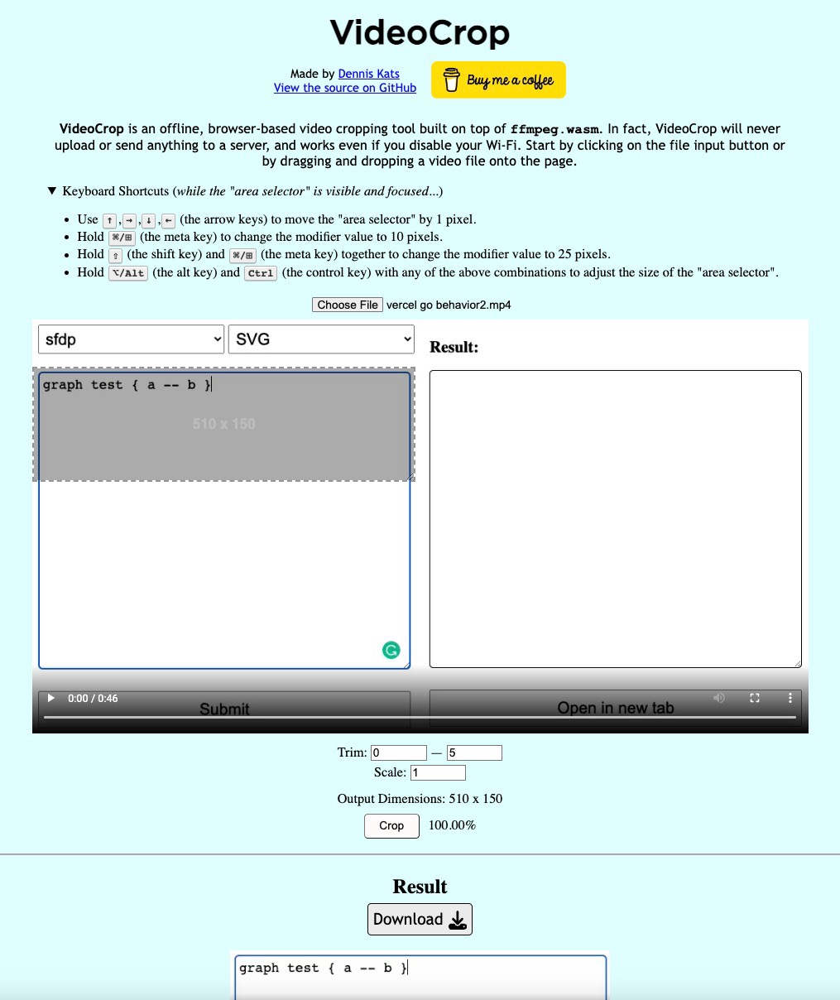

# [VideoCrop](https://videocrop.vercel.app/)

**VideoCrop** is an offline, browser-based video cropping tool built on top of **`ffmpeg.wasm`**. The app never uploads or sends anything to a server, therefore performing all video manipulation on the client-side.

    

# Support me

If you like this project and want to support more projects like it, consider buying me a coffee!

